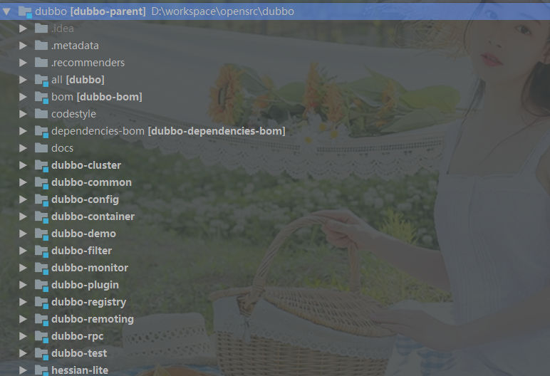
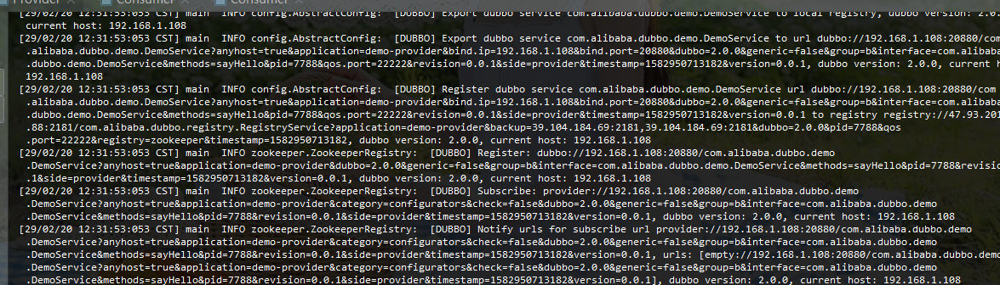
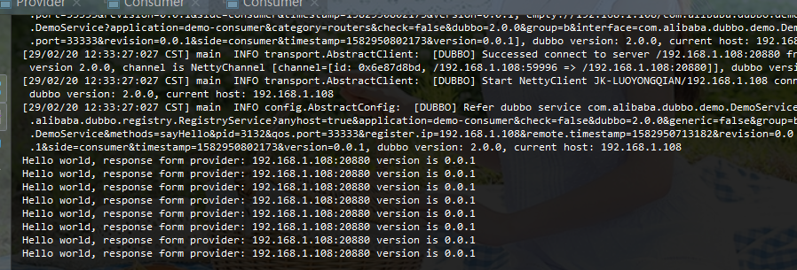
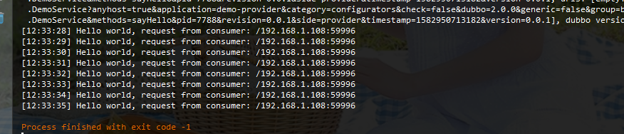

# 02-DUBBO调试环境搭建

首先，提供一个[DUBBO官网]( http://dubbo.apache.org/zh-cn/docs/user/quick-start.html )地址，官网有详解的资料，从简单的上手使用配置到框架设计及源码分析，应有尽有。所以，官网才是最详细的资料。

## 开发环境
   - JDK
   - IDEA
   - GIT
   - MAVEN
   > 目前DUBBO使用的是Maven来构建项目，因此我们需要安装`Maven`。

## 源代码下载

使用Git从`https://github.com/alibaba/dubbo`直接下载，但强烈建议将此项目`fork`到自己的仓库中，方便自己添加注释，做笔记记录。

下载之后，Maven会自动下载依赖，可能需要比较久的时间，不要着急慢慢等。当所有依赖下载完成之后 ，目录结构如下：



| 目录             | 功能                                                         |
| ---------------- | ------------------------------------------------------------ |
| all              | 此项目没有代码,只有一个Pom文件,功能是定义了打包脚本，将所有的项目打包成一个发布包.`The all in one project of dubbo` |
| bom              | dubbo内部相关依赖配置                                        |
| codestyle        | 只有一个xml文件,控制编码风格                                 |
| dependencies-bom | dubbo对外部依赖控制                                          |
| dubbo-cluster    | dubbo集群控制,主要包括`LoadBalance `和`Router`相关           |
| dubbo-common     | 通用公共的工具类封装,比如线程池,序列化,并发,编译,字节等      |
| dubbo-config     | 配置相关,主要是与Spring集成配置.通过SPI机制实现。主要有围绕生活者和消费者这两端进行配置，即`ServiceConfig`和`ReferenceConfig` |
| dubbo-container  | 容器实现                                                     |
| dubbo-demo       | demo实现,官方提供的一个provider和consumer                    |
| dubbo-filter     | 拦截器功能实现                                               |
| dubbo-monitor    | 监控中心实现                                                 |
| dubbo-plugin     | 插件机制实现                                                 |
| dubbo-registry   | 注册模块实现                                                 |
| dubbo-remoting   | 远程调用实现<主要包括Exchange,transport,Serialize等实现，通讯的底层实现>。<br>Exchange: 信息交换层，建立统一的dubbo中Request和Response模型。<br>Transport: 网络传输层，把网络传输封装为统一接口。比如封装Mina,netty为Dubbo的统一接口。<br>Serialize: 序列化 |
| dubbo-rpc        | 主要是对各种远程调用封装。主要是通过Protocol抽象实现。       |
| dubbo-test       | 一些测试示例相关，比如性能测试，集成测试等示例               |
| hessian-lite     | 内嵌hession版本。hession是一种具体序列化协议实现             |

## 调试

我们将使用`dubbo-demo`模块进行DEMO调试。

### 1. ZK环境准备

此处不详细讲解zk环境过程,自己可以百度

### 2、修改配置

分别修改服务提供者`dubbo-demo\dubbo-demo-provider\src\main\resources\META-INF\spring\dubbo-demo-provider.xml`和消费`dubbo-demo\dubbo-demo-consumer\src\main\resources\META-INF\spring\dubbo-demo-consumer.xml`ZK配置信息

服务提供者设置zk的地址。

```properties
<dubbo:registry address="zookeeper://xx.xx.xx.xx:2181?backup=yyy.yy.yy.yy:2181,zz.zz.zz.zz:2181" />
```

服务消费者设置zk信息

```properties
<dubbo:registry address="zookeeper://xx.xx.xx.xx:2181?backup=yyy.yy.yy.yy:2181,zz.zz.zz.zz:2181" />
```

### 3、启动Provider类

`dubbo\dubbo-demo\dubbo-demo-provider\src\main\java\com\alibaba\dubbo\demo\provider\Provider.java`

启动日志如下：



### 4、启动Consumer



### 5、Provider接收到请求



这表明，环境已经安装成功！！
接下来就可以断点调度，源码阅读啦。