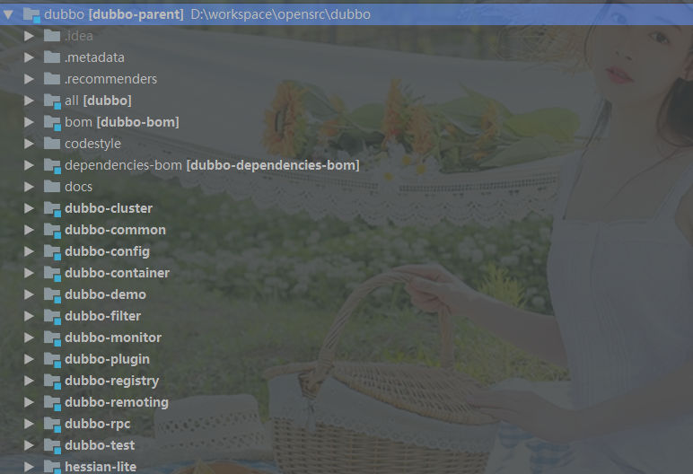

# 02-DUBBO调试环境搭建
## 开发环境
   - JDK
   - IDEA
   - GIT
   - MAVEN
   > 目前DUBBO使用的是Maven来构建项目，因此我们需要`Maven`

## 源代码下载

使用Git从`https://github.com/alibaba/dubbo`直接下载，但强烈建议将此项目`fork`到自己的仓库中，方便自己添加注释，笔记记录。

下载之后，Maven会自动下载依赖，可能需要比较久的时间，不要着急慢慢等。当所有依赖下载完成之后 ，目录结构如下：

| 目录             | 功能                                                         |
| ---------------- | ------------------------------------------------------------ |
| all              | 此项目没有代码,只有一个Pom文件,功能是将所有的项目打包成一个发布包.`The all in one project of dubbo` |
| bom              | dubbo内部相关依赖配置                                        |
| codestyle        | 只有一个xml文件,控制编码风格                                 |
| dependencies-bom | dubbo对外部依赖控制                                          |
| docs             | --                                                           |
| dubbo-cluster    | dubbo集群控制,主要包括`LoadBalance `和`Router`相关           |
| dubbo-common     | 通用公共的工具类封装,比如线程池,序列化,并发,编译,字节等      |
| dubbo-config     | 配置相关,主要是与Spring集成配置.通过SPI机制实现              |
| dubbo-container  | 容器实现                                                     |
| dubbo-demo       | demo实现,官方提供的一个provider和consumer                    |
| dubbo-filter     | 拦截器功能实现                                               |
| dubbo-monitor    | 监控中心实现                                                 |
| dubbo-plugin     | 插件机制实现                                                 |
| dubbo-registry   | 注册模块实现                                                 |
| dubbo-remoting   | 远程调用实现                                                 |
| dubbo-rpc        | 主要是对各种远程调用协议封                                   |
| dubbo-test       |                                                              |
| hessian-lite     |                                                              |
|                  |                                                              |
|                  |                                                              |

## 调试

我们将使用`dubbo-demo`模块进行DEMO调试。

### 1. ZK环境准备

此处不详细讲解zk环境过程,自己可以百度

### 2、修改配置

`dubbo-demo\dubbo-demo-provider\src\main\resources\META-INF\spring\dubbo-demo-provider.xml`

设置zk的地址。

1、使用了spring的schema扩展机制。故对应的有
	DubboNamespaceHandler和DubboBeanDefinitionParser
	具体对应信息如下：
		• application对应ApplicationConfig
		• registry对应RegistryConfig
		• monitor对应MonitorConfig
		• provider对应ProviderConfig
		• consumer对应ConsumerConfig
		• protocol对应ProtocolConfig
		• service对应ServiceConfig
		• reference对应ReferenceConfig
2、具体DUBBO的Provider初始成为什么Bean?
	(1)DUBBO可以不依赖于Spring独立运行，此时，配置service对应ServiceConfig
	(2)为了集成Spring,加入了ServiceBean继承了ServiceConfig。

3、DUBBO的COUSUME怎么初始化？
	Consumer配置与ReferenceConfig对应。为了与Spring集成，发现服务的过程又加入了一个和Spring相关联的ReferenceBean，继承了ReferenceConfig。
	利用Spring就做了上述过程，得到相应的配置数据，然后启动相应的服务。如果想剥离Spring，我们就可以手动来创建上述配置对象，通过ServiceConfig和ReferenceConfig的API来启动相应的服务
	