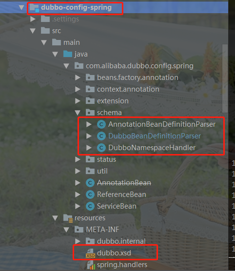

# DUBBO之Provider启动流程

## SPI机制

 SPI 全称为 Service Provider Interface，是Java中一种`服务发现机制`。 不过DUBBO在原生的SPI机制进行了相关扩展，实现了KEY-VALUE形式。SPI的核心类是`ServiceLoader`，此处不对此类进行相关讲解。需要了解的可以自己百度/Google。

## Spring Schema扩展

可参考官网[XML Schema Authoring](https://docs.spring.io/spring/docs/5.1.14.RELEASE/spring-framework-reference/core.html#xml-custom)

`Spring Schema`扩展可以按如下步骤进行：

- 定义好Bean
- 要的Beam定义xsd文件
- 通过继承`NamespaceHanlderSupport`来实现`NamespaceHandler`接口
- 通过继承`AbstractSingleBeanDefinitionParser `来实现`BeanDefinitionParser`接口
- 编写`spring.handlers`和`spring.schemas`文件，将上面实现的组件与Spring进行绑定
- 编写Bean文件<Xml形式>
- 测试

必要步骤只需要中间4步。

#### 1、编写自定义Bean

```java
package com.roboslyq.schema.bean;
public class UserConfig {
    private int id;
    private String name;
    private int age;
    private String sex;
    private String email;
    // 省略getter和setter... ... 
}
```

#### 2、定义xsd

此文件放在一般放在`META-INF`，但具体位置没有关系，后续绑定时可以指定文件所在路径。

```xml
<?xml version="1.0" encoding="UTF-8"?>
<xsd:schema xmlns="http://www.mycompany.com/schema/myns"
            xmlns:xsd="http://www.w3.org/2001/XMLSchema"
            xmlns:beans="http://www.springframework.org/schema/beans"
            targetNamespace="http://www.mycompany.com/schema/myns"
            elementFormDefault="qualified"
            attributeFormDefault="unqualified">

    <xsd:import namespace="http://www.springframework.org/schema/beans"/>

    <xsd:element name="dateformat">
        <xsd:complexType>
            <xsd:complexContent>
                <xsd:extension base="beans:identifiedType">
                    <xsd:attribute name="lenient" type="xsd:boolean"/>
                    <xsd:attribute name="pattern" type="xsd:string" use="required"/>
                </xsd:extension>
            </xsd:complexContent>
        </xsd:complexType>
    </xsd:element>
    <xsd:element name="user">
        <xsd:complexType>
            <xsd:complexContent>
                <xsd:extension base="beans:identifiedType">
                    <xsd:attribute name = "age" type="xsd:int" />
                    <xsd:attribute name = "name" type="xsd:string" />
                </xsd:extension>
            </xsd:complexContent>
        </xsd:complexType>
    </xsd:element>
</xsd:schema>
```

> `targetNamespace="http://www.mycompany.com/schema/myns"`和`xmlns="http://www.mycompany.com/schema/myns"`为我们自己定义的。此处直接引用了官网的中的`dateformat`样例。`user`标签为我们自己定义实现。
>
> 注意：此处的``targetNamespace`中`myns`很关键，是我们的命名空间

#### 3、NamespaceHandler实现

```java
package com.roboslyq.schema;

import org.springframework.beans.factory.xml.NamespaceHandlerSupport;
public class DemoNamespaceHanler extends NamespaceHandlerSupport {

    @Override
    public void init() {
        registerBeanDefinitionParser("dateformat", new SimpleDateFormatBeanDefinitionParser());
        registerBeanDefinitionParser("user", new UserBeanDefinitionParser());
    }
}
```

#### 4、BeanDefinitionParser实现

针对不同的Bean，需要不同的`BeanDefinitionParser`实现

```java
package com.roboslyq.schema;

import org.springframework.beans.factory.support.BeanDefinitionBuilder;
import org.springframework.beans.factory.xml.AbstractSingleBeanDefinitionParser;
import org.springframework.util.StringUtils;
import org.w3c.dom.Element;

import java.text.SimpleDateFormat;
public class SimpleDateFormatBeanDefinitionParser extends AbstractSingleBeanDefinitionParser {
    @Override
    protected Class getBeanClass(Element element) {
        return SimpleDateFormat.class;
    }
    @Override
    protected void doParse(Element element, BeanDefinitionBuilder bean) {
        // this will never be null since the schema explicitly requires that a value be supplied
        String pattern = element.getAttribute("pattern");
        bean.addConstructorArgValue(pattern);

        // this however is an optional property
        String lenient = element.getAttribute("lenient");
        if (StringUtils.hasText(lenient)) {
            bean.addPropertyValue("lenient", Boolean.valueOf(lenient));
        }
        // this however is an optional property
        String age = element.getAttribute("age");
        if (StringUtils.hasText(age)) {
            bean.addPropertyValue("age", Integer.valueOf(age));
        }
    }

}
```


```java
package com.roboslyq.schema;

import com.roboslyq.schema.bean.UserConfig;
import org.springframework.beans.factory.support.BeanDefinitionBuilder;
import org.springframework.beans.factory.xml.AbstractSingleBeanDefinitionParser;
import org.springframework.util.StringUtils;
import org.w3c.dom.Element;

import java.text.SimpleDateFormat;

public class UserBeanDefinitionParser extends AbstractSingleBeanDefinitionParser {
    @Override
    protected Class getBeanClass(Element element) {
        return UserConfig.class;
    }
    @Override
    protected void doParse(Element element, BeanDefinitionBuilder bean) {

        // this however is an optional property
        //此处只添加了一个属性，其它属性可以依此类推添加
        String age = element.getAttribute("age");
        if (StringUtils.hasText(age)) {
            bean.addPropertyValue("age", Integer.valueOf(age));
        }
        //... ...
    }

}
```

#### 5、定义`spring.handlers`和`spring.schemas`

`spring.handlers`和`spring.schemas`这两个文件必须在路径`META-INF`下，

`spring.handlers`文件添加内容：

```properties
http\://www.mycompany.com/schema/myns=com.roboslyq.schema.DemoNamespaceHanler
```

`spring.schemas`文件添加内容：

```properties
http\://www.mycompany.com/schema/myns/myns.xsd=META-INF/myns.xsd
```

> 注意,符号`:` 必须转义

#### 6、编写Bean文件

```xml
<?xml version="1.0" encoding="UTF-8"?>
<beans xmlns="http://www.springframework.org/schema/beans"
       xmlns:xsi="http://www.w3.org/2001/XMLSchema-instance"
       xmlns:myns="http://www.mycompany.com/schema/myns"
       xsi:schemaLocation="
        http://www.springframework.org/schema/beans https://www.springframework.org/schema/beans/spring-beans.xsd
        http://www.mycompany.com/schema/myns http://www.mycompany.com/schema/myns/myns.xsd">

    <!-- as a top-level bean -->
    <myns:dateformat id="defaultDateFormat" pattern="yyyy-MM-dd HH:mm" lenient="true"/>
    <myns:user id="1" age="20" name="roboslyq"/>

    <bean id="jobDetailTemplate" abstract="true">
        <property name="dateFormat">
            <!-- as an inner bean -->
            <myns:dateformat pattern="HH:mm MM-dd-yyyy"/>
        </property>
    </bean>

</beans>
```

#### 7、测试

```java
package com.roboslyq.schema;

import com.roboslyq.schema.bean.UserConfig;
import org.springframework.context.ApplicationContext;
import org.springframework.context.support.ClassPathXmlApplicationContext;

import java.text.SimpleDateFormat;
import java.util.Date;

import java.text.SimpleDateFormat;

/**
 * @author lyq
 * @date  2019-02-01
 */
public class SpringSchemaApplication
{
    public static void main( String[] args )
    {
        ApplicationContext ctx = new ClassPathXmlApplicationContext("classpath:demo.xml");
        SimpleDateFormat simpleDateFormat = (SimpleDateFormat)ctx.getBean("defaultDateFormat");
        System.out.println(String.format("spring rpc test:" + simpleDateFormat.format(new Date())));
        UserConfig user = ctx.getBean(UserConfig.class);
        System.out.println(user.getAge());
    }
}

```

打印结果如下：

>... ...
>spring rpc test:2020-03-01 23:50
>20

有上SpringSchema扩展的经验，我们再来看Dubbo对其的实现。

## DUBBO 实现Spring Schema 扩展

基于`dubbo\dubbo-config\dubbo-config-spring` ` 模块中的 `META-INF/spring.handlers` 配置，Spring 在遇到 dubbo 名称空间时，会回调 `DubboNamespaceHandler`。

所有 dubbo 的标签，都统一用 `DubboBeanDefinitionParser` 进行解析，基于一对一属性映射，将 XML 标签解析为 Bean 对象。

在 `ServiceConfig.export()` 或 `ReferenceConfig.get()` 初始化时，将 Bean 对象转换 URL 格式，所有 Bean 属性转成 URL 的参数。

然后将 URL 传给 [协议扩展点](http://dubbo.apache.org/zh-cn/docs/dev/impls/protocol.html)，基于扩展点的 [扩展点自适应机制](http://dubbo.apache.org/zh-cn/docs/dev/SPI.html)，根据 URL 的协议头，进行不同协议的服务暴露或引用。

### 1、编写自定义Bean

在Dubbo中，主要有以下几个Bean配置：

`ApplicationConfig`

`ModuleConfig`

`RegistryConfig`

`MonitorConfig`

`ProviderConfig`

`ConsumerConfig`

`ProtocolConfig`

`ServiceBean`

`ReferenceBean`

`AnnotationBeanDefinitionParser`

### 2：定义xsd

在`dubbo-config-spring`项目中的`META-INF`目录中的`dubbo.xsd`



###  3、NamespaceHanler实现

具体实现类为**`DubboNamespaceHandler`**（见上图），`DubboNamespaceHandler`源码如下：

```java
package com.alibaba.dubbo.config.spring.schema;

import com.alibaba.dubbo.common.Version;
import com.alibaba.dubbo.config.*;
import com.alibaba.dubbo.config.spring.ReferenceBean;
import com.alibaba.dubbo.config.spring.ServiceBean;
import org.springframework.beans.factory.xml.NamespaceHandlerSupport;

/**
 * DubboNamespaceHandler
 * (1)Spring的NamespaceHandlerSupport扩展点，绑定配置文件中的标签与Bean的关系。
 * 例如：每一个dubbo:service标签对应一个ServiceBean.class
 * (2)serviceBean实现了InitializingBean，所以每一个dubbo:service的入口均为afterProrpertiesSet
 * (3) ServiceBean继承了AbstractServiceConfig，顶承接口为dubbo中的config。故serviceBean的成员变量与dubbo:service中的配置参数一一对应。
 * 		并且每个serviceBean都是一个新Bean（不同实例），所以不存在线程安全问题
 * @export
 */
public class DubboNamespaceHandler extends NamespaceHandlerSupport {

    static {
        Version.checkDuplicate(DubboNamespaceHandler.class);
    }

    public void init() {
        registerBeanDefinitionParser("application", new DubboBeanDefinitionParser(ApplicationConfig.class, true));
        registerBeanDefinitionParser("module", new DubboBeanDefinitionParser(ModuleConfig.class, true));
        registerBeanDefinitionParser("registry", new DubboBeanDefinitionParser(RegistryConfig.class, true));
        registerBeanDefinitionParser("monitor", new DubboBeanDefinitionParser(MonitorConfig.class, true));
        registerBeanDefinitionParser("provider", new DubboBeanDefinitionParser(ProviderConfig.class, true));
        registerBeanDefinitionParser("consumer", new DubboBeanDefinitionParser(ConsumerConfig.class, true));
        registerBeanDefinitionParser("protocol", new DubboBeanDefinitionParser(ProtocolConfig.class, true));
        registerBeanDefinitionParser("service", new DubboBeanDefinitionParser(ServiceBean.class, true));
        registerBeanDefinitionParser("reference", new DubboBeanDefinitionParser(ReferenceBean.class, false));
        registerBeanDefinitionParser("annotation", new AnnotationBeanDefinitionParser());
    }

}
```

上面源码中的`registerBeanDefinitionParser`方法中的第一个参数与具体配置对应信息如下：
		• application对应ApplicationConfig
		• registry对应RegistryConfig
		• monitor对应MonitorConfig
		• provider对应ProviderConfig
		• consumer对应ConsumerConfig
		• protocol对应ProtocolConfig
		• service对应ServiceConfig
		• reference对应ReferenceConfig

### 4：BeanDefinitionParser实现

`DubboBeanDefinitionParser`是DUBBO中对spring中`BeanDefinitionParser`的实现，此方法在`DubboNamespaceHandler`中在系统启动时被调用。BeanDefinitionParser是对对Dubbo中所有的配置类型进行了统一封装，通过构造函数传入的Class类型来指定具体的配置项。

 目前支持以下配置：

- <dubbo:application/>-应用名称，每一个应用都有一个标识可以用来记录应用依赖关系

-  <dubbo:module/>-可选参数，用于配置当前模块信息，可选
-  <dubbo:registry/>-注册中心
-  <dubbo:monitor/>-监控中心用于配置连接监控中心相关信息，可选
-  <dubbo:provider/>-可选参数，当 ProtocolConfig 和 ServiceConfig 某属性没有配置时，采用此缺省值，可选
-  <dubbo:consumer/>-可选参数，当 ReferenceConfig 某属性没有配置时，采用此缺省值，可选
-  <dubbo:protocol/>-协议
-  <dubbo:service/>-服务提供者
-  <dubbo:reference/>-服务消费者
-  <dubbo:annotation/>-可选参数

## 知识点

**1、具体DUBBO的Provider初始成为什么Bean?**
	(1)DUBBO可以不依赖于Spring独立运行，此时，配置service对应ServiceConfig
	(2)为了集成Spring,加入了ServiceBean继承了ServiceConfig。

**2、DUBBO的COUSUME怎么初始化？**
	Consumer配置与ReferenceConfig对应。为了与Spring集成，发现服务的过程又加入了一个和Spring相关联的ReferenceBean，继承了ReferenceConfig。
	利用Spring的Schematic扩展机制，得到相应的配置数据，然后启动相应的服务。如果想剥离Spring，我们就可以手动来创建上述配置对象，通过ServiceConfig和ReferenceConfig的API来启动相应的服务