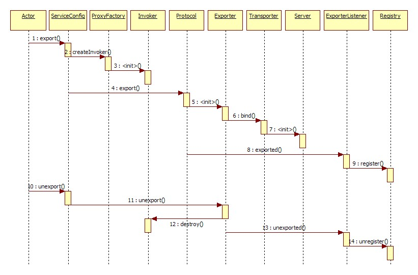
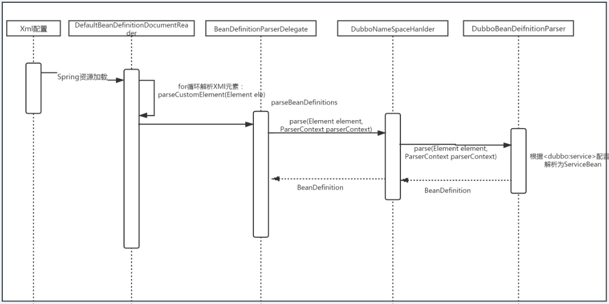
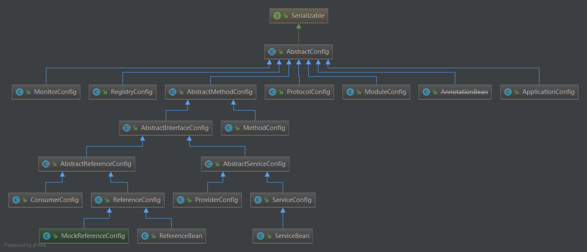
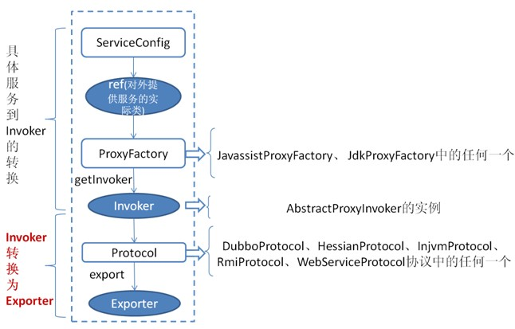

# 05-DUBBO之服务端启动流程

## 暴露服务时序

首先来看官网发布的服务提供方暴露服务的蓝色初始化链，时序图如下：



官网提供的时序比较粗，只有个大概方向。我自己根据官网的时序图作了一更详细的。但总体流程是一样的。


先从官网提供的图来对整个服务导出(暴露)的过程进行总结:

1. Spring事件通知机制：在所有的BeanDefinition创建完成之后，会发起相关的通知。onApplicationEvent。此处为Actor入口
2. 开始本地服务导出：`ServiceConfig`调用`ProxyFacotry#getInvoker(T proxy, Class<T> type, URL url)`，此时url为`injvm`类型。通过字节码技术(默认`JavaAssit`)创建出了`Invoker`代理类，此类代理具体实的实现类。
3. 创建出Invoker之后，然后根据具体的`Protocol`进行导出操作`Protocol#export(Invoker<T> invoker) `。会在导出方法中完成服务器启动，监听相关IP和PORT（通过`Exchanges`和`TransferPort`相关完成），并最终返回Exporter对象。此时，本地服务已经启动完成，可以进行直连调用。
4. 在本地服务导出(服务启动)之后，若服务不需要注册，则结束。如果服务需要注册，则调用`ProxyFacotry#getInvoker(T proxy, Class<T> type, URL url)`，此时url为`Registry`类型。在`RegitstryProtocol`中，会根据具体的协议(比如`DubboProtocol`)先启动服务，然后在调用具体的`registry()`方法进行注册中心注册。

## 0、XML配置元素

后面讲解，以

```xml
<?xml version="1.0" encoding="UTF-8"?>
<beans xmlns="http://www.springframework.org/schema/beans"
       xmlns:xsi="http://www.w3.org/2001/XMLSchema-instance"
       xmlns:myns="http://www.mycompany.com/schema/myns"
       xsi:schemaLocation="
        http://www.springframework.org/schema/beans https://www.springframework.org/schema/beans/spring-beans.xsd
        http://www.mycompany.com/schema/myns http://www.mycompany.com/schema/myns/myns.xsd">

    <!-- as a top-level bean -->
    <myns:dateformat id="defaultDateFormat" pattern="yyyy-MM-dd HH:mm" lenient="true"/>
    <myns:user id="1" age="20" name="roboslyq"/>
    <myns:user id="2" age="21" name="roboslyq"/>

    <bean id="jobDetailTemplate" abstract="true">
        <property name="dateFormat">
            <!-- as an inner bean -->
            <myns:dateformat pattern="HH:mm MM-dd-yyyy"/>
        </property>
    </bean>

</beans>
```


## 1、Spring集成



### 解析服务流程

1. 基于 dubbo.jar 内的 `META-INF/spring.handlers` 配置，Spring 在遇到 dubbo 名称空间时，会回调 `DubboNamespaceHandler`。

2. 所有 dubbo 的标签，都统一用 `DubboBeanDefinitionParser` 进行解析，基于一对一属性映射，将 XML 标签解析为 Bean 对象。

3. 在 `ServiceConfig.export()` 或 `ReferenceConfig.get()` 初始化时，将 Bean 对象转换 URL 格式，所有 Bean 属性转成 URL 的参数。

4. 然后将 URL 传给 [协议扩展点](http://dubbo.apache.org/zh-cn/docs/dev/impls/protocol.html)，基于扩展点的 [扩展点自适应机制](http://dubbo.apache.org/zh-cn/docs/dev/SPI.html)，根据 URL 的协议头，进行不同协议的服务暴露或引用。

## 1.1 Spring入口类DefaultBeanDefinitionDocumentReader

关于此`DefaultBeanDefinitionDocumentReader`之前的Spring启动流程，此处就不详细讲解了。有需要的朋友可以自行百度，查找其它资料。此处主要分析Dubbo相关标签解析，从`DefaultBeanDefinitionDocumentReader#parseBeanDefinitions`方法开始：

```java
protected void parseBeanDefinitions(Element root, BeanDefinitionParserDelegate delegate) {		//此条件为true,因为dubbo的配置，也是以spring 的bean标签为最外层标签。
		if (delegate.isDefaultNamespace(root)) {
			NodeList nl = root.getChildNodes();
			for (int i = 0; i < nl.getLength(); i++) {
				Node node = nl.item(i);
                //排除xml中的杂项元素，比如注释，xmlns等
                //
				if (node instanceof Element) {
					Element ele = (Element) node;
					if (delegate.isDefaultNamespace(ele)) {
						parseDefaultElement(ele, delegate);
					}
					else {
						delegate.parseCustomElement(ele);
					}
				}
			}
		}
```

### 1.2 BeanDefinitionParserDelegate

```java
	public BeanDefinition parseCustomElement(Element ele) {
		return parseCustomElement(ele, null);
	}

	public BeanDefinition parseCustomElement(Element ele, BeanDefinition containingBd) {
        //namespaceUri = "http://code.alibabatech.com/schema/dubbo"
		String namespaceUri = getNamespaceURI(ele);
        //DubboNamespaceHandler
		NamespaceHandler handler = this.readerContext.getNamespaceHandlerResolver().resolve(namespaceUri);
		if (handler == null) {
			error("Unable to locate Spring NamespaceHandler for XML schema namespace [" + namespaceUri + "]", ele);
			return null;
		}
        //调用DubboNamespaceHander父类NamespaceHandlerSupport方法
		return handler.parse(ele, new ParserContext(this.readerContext, this, containingBd));
	}
```

### 1.3 NamespaceHandlerSupport

```java
@Override
	public BeanDefinition parse(Element element, ParserContext parserContext) {
		return findParserForElement(element, parserContext) //获取BeanDefinitionParser
            	.parse(element, parserContext);//调用Parser进行解析
	}

	/**
	 * Locates the {@link BeanDefinitionParser} from the register implementations using
	 * the local name of the supplied {@link Element}.
	 * 根据elements找到对应的BeanDefinitionParser
	 */
	private BeanDefinitionParser findParserForElement(Element element, ParserContext parserContext) {
        //localname = application或registry或protocol等dubbo标签。
		String localName = parserContext.getDelegate().getLocalName(element);
        //parser = DubboBeanDefinitionParser
		BeanDefinitionParser parser = this.parsers.get(localName);
		if (parser == null) {
			parserContext.getReaderContext().fatal(
					"Cannot locate BeanDefinitionParser for element [" + localName + "]", element);
		}
		return parser;
	}
```


## 2、入口DubboNamespaceHandler与DubboBeanDefinitionParser

`DubboNameSpaceHandler`和`DubboBeanDefinitionParser`是Spring标准扩展实现。可以复用此特性与Spring框架实现整合。

其中，服务提供者在`NameSpaceHandler`中如下：

```java
public class DubboNamespaceHandler extends NamespaceHandlerSupport {

    static {
        Version.checkDuplicate(DubboNamespaceHandler.class);
    }

    public void init() {
        registerBeanDefinitionParser("application", new DubboBeanDefinitionParser(ApplicationConfig.class, true));
        registerBeanDefinitionParser("module", new DubboBeanDefinitionParser(ModuleConfig.class, true));
        registerBeanDefinitionParser("registry", new DubboBeanDefinitionParser(RegistryConfig.class, true));
        registerBeanDefinitionParser("monitor", new DubboBeanDefinitionParser(MonitorConfig.class, true));
        registerBeanDefinitionParser("provider", new DubboBeanDefinitionParser(ProviderConfig.class, true));
        registerBeanDefinitionParser("consumer", new DubboBeanDefinitionParser(ConsumerConfig.class, true));
        registerBeanDefinitionParser("protocol", new DubboBeanDefinitionParser(ProtocolConfig.class, true));
        registerBeanDefinitionParser("service", new DubboBeanDefinitionParser(ServiceBean.class, true));
        registerBeanDefinitionParser("reference", new DubboBeanDefinitionParser(ReferenceBean.class, false));
        registerBeanDefinitionParser("annotation", new AnnotationBeanDefinitionParser());
    }

}
```

请注意上面的**ServiceBean.class**,这就是服务提供者的配置抽象，此处是服务提供者的启动时入口所在。


## 2、ServiceBean

### 2.1 总体的Config继承体系



在Dubbo体系中，有一个总的配置抽象类`AbstractConfig`，所有配置类均继承于此类。ServiceBean是针对具体每一个Bean的配置。每一个配置对应一个ServiceBean。


### 2.2 ServiceBean继承体系


可见，`ServiceBean`继承于`ServiceConfig`。Dubbo可以脱离Spring框架独立存在，此时作用就是`ServiceConfig`。为了集成到Spring框架中，才有了`ServiceBean`实现类。

## Protocol自适应

在`ServiceConfig`中有一个方法获取Protocol类，此类是动态生成的`自适应类`。生成类型是Protocol$Adaptive

```java
    private static final Protocol protocol = ExtensionLoader.getExtensionLoader(Protocol.class).getAdaptiveExtension();

```

`Protocol$Adaptive`源码如下：

```java
package com.alibaba.dubbo.demo.consumer;

/**
 * 此类通过断点生成，在ExtensionLoader.createAdaptiveExtensionClass()方法中的code变量
 */
//package com.alibaba.dubbo.rpc;

import com.alibaba.dubbo.common.extension.ExtensionLoader;
//类名XXXX$Adaptive，如Protocol$Adaptive
public class Protocol$Adaptive implements com.alibaba.dubbo.rpc.Protocol {
	public void destroy() {
		throw new UnsupportedOperationException(
				"method public abstract void com.alibaba.dubbo.rpc.Protocol.destroy() of interface com.alibaba.dubbo.rpc.Protocol is not adaptive method!");
	}

	public int getDefaultPort() {
		throw new UnsupportedOperationException(
				"method public abstract int com.alibaba.dubbo.rpc.Protocol.getDefaultPort() of interface com.alibaba.dubbo.rpc.Protocol is not adaptive method!");
	}
	//Adaptive方法，自适应生成
	public com.alibaba.dubbo.rpc.Invoker refer(java.lang.Class arg0, com.alibaba.dubbo.common.URL arg1)
			throws com.alibaba.dubbo.rpc.RpcException {
		if (arg1 == null)
			throw new IllegalArgumentException("url == null");
		com.alibaba.dubbo.common.URL url = arg1;
		//默认dubbo协议，自适应
		String extName = (url.getProtocol() == null ? "dubbo" : url.getProtocol());
		if (extName == null)
			throw new IllegalStateException("Fail to get extension(com.alibaba.dubbo.rpc.Protocol) name from url("
					+ url.toString() + ") use keys([protocol])");
		//根据extName获取具体的扩展点。防止if代码，并且方便客户端随意扩展
		com.alibaba.dubbo.rpc.Protocol extension = (com.alibaba.dubbo.rpc.Protocol) ExtensionLoader
				.getExtensionLoader(com.alibaba.dubbo.rpc.Protocol.class).getExtension(extName);
		return extension.refer(arg0, arg1);
	}

	public com.alibaba.dubbo.rpc.Exporter export(com.alibaba.dubbo.rpc.Invoker arg0)
			throws com.alibaba.dubbo.rpc.RpcException {
		if (arg0 == null)
			throw new IllegalArgumentException("com.alibaba.dubbo.rpc.Invoker argument == null");
		if (arg0.getUrl() == null)
			throw new IllegalArgumentException("com.alibaba.dubbo.rpc.Invoker argument getUrl() == null");
		com.alibaba.dubbo.common.URL url = arg0.getUrl();
		String extName = (url.getProtocol() == null ? "dubbo" : url.getProtocol());
		if (extName == null)
			throw new IllegalStateException("Fail to get extension(com.alibaba.dubbo.rpc.Protocol) name from url("
					+ url.toString() + ") use keys([protocol])");
		com.alibaba.dubbo.rpc.Protocol extension = (com.alibaba.dubbo.rpc.Protocol) ExtensionLoader
				.getExtensionLoader(com.alibaba.dubbo.rpc.Protocol.class).getExtension(extName);
		return extension.export(arg0);
	}
}
```

### 暴露服务

先参考一下官网的暴露服务过程图：



上图是服务提供者暴露服务的主过程：

**1. Bean转换成Invoker**

首先 `ServiceConfig` 类拿到对外提供服务的实际类 ref(如：HelloWorldImpl),然后通过 `ProxyFactory` 类的 `getInvoker` 方法使用 ref 生成一个 `AbstractProxyInvoker` 实例，到这一步就完成具体服务到 `Invoker` 的转化。

**2. Invoker转换为Exporter**

接下来就是 `Invoker` 转换到 `Exporter` 的过程。

Dubbo 处理服务暴露的关键就在 `Invoker` 转换到 `Exporter` 的过程，上图中的红色部分。下面我们以 Dubbo 和 RMI 这两种典型协议的实现来进行说明：

**Dubbo 的实现**

Dubbo 协议的 `Invoker` 转为 `Exporter` 发生在 `DubboProtocol` 类的 `export` 方法，它主要是打开 socket 侦听服务，并接收客户端发来的各种请求，通讯细节由 Dubbo 自己实现。

**RMI 的实现**

RMI 协议的 `Invoker` 转为 `Exporter` 发生在 `RmiProtocol`类的 `export` 方法，它通过 Spring 或 Dubbo 或 JDK 来实现 RMI 服务，通讯细节这一块由 JDK 底层来实现，这就省了不少工作量。


#### 1. 只暴露服务端口：

在没有注册中心，直接暴露提供者的情况下 [[1\]](http://dubbo.apache.org/zh-cn/docs/dev/implementation.html#fn1)，`ServiceConfig` 解析出的 URL 的格式为： `dubbo://service-host/com.foo.FooService?version=1.0.0`。

基于扩展点自适应机制，通过 URL 的 `dubbo://` 协议头识别，直接调用 `DubboProtocol`的 `export()` 方法，打开服务端口。

#### 2. 向注册中心暴露服务：

在有注册中心，需要注册提供者地址的情况下 [[2\]](http://dubbo.apache.org/zh-cn/docs/dev/implementation.html#fn2)，`ServiceConfig` 解析出的 URL 的格式为: `registry://registry-host/org.apache.dubbo.registry.RegistryService?export=URL.encode("dubbo://service-host/com.foo.FooService?version=1.0.0")`，

基于扩展点自适应机制，通过 URL 的 `registry://` 协议头识别，就会调用 `RegistryProtocol` 的 `export()` 方法，将 `export` 参数中的提供者 URL，先注册到注册中心。

再重新传给 `Protocol` 扩展点进行暴露： `dubbo://service-host/com.foo.FooService?version=1.0.0`，然后基于扩展点自适应机制，通过提供者 URL 的 `dubbo://` 协议头识别，就会调用 `DubboProtocol` 的 `export()` 方法，打开服务端口。

## 总结

1、Spring循环调用BeanDefinitionParser解析标签，每个标签解析一次

2、因此dubbo:service如果有多个，需要解析多次。每一次解析均生成一个新的`ServiceBean`来与dubbo:service配置对应。

3、dubbo通过URI（Dubbo框架自定义）来导出服务，在导出服务时，会启动netty服务器(默认)。但此时会缓存当前的nettyServer。缓存的key为ip:port。因此，只有第1个dubbo:service标签才会启动服务，后续直接从缓存中获取，reset相关配置即可。

4、自适应：dubbo自适应

[dubbo自适应]()

5、泛化调用

[泛化调用]( http://dubbo.apache.org/zh-cn/docs/user/demos/generic-reference.html )


# 参考资料

https://www.jianshu.com/p/7f3871492c71

https://mp.weixin.qq.com/s/J1yUqFPN6Cf9M01W0paYcA

http://dubbo.apache.org/zh-cn/docs/source_code_guide/export-service.html

 http://dubbo.apache.org/zh-cn/docs/dev/implementation.html 