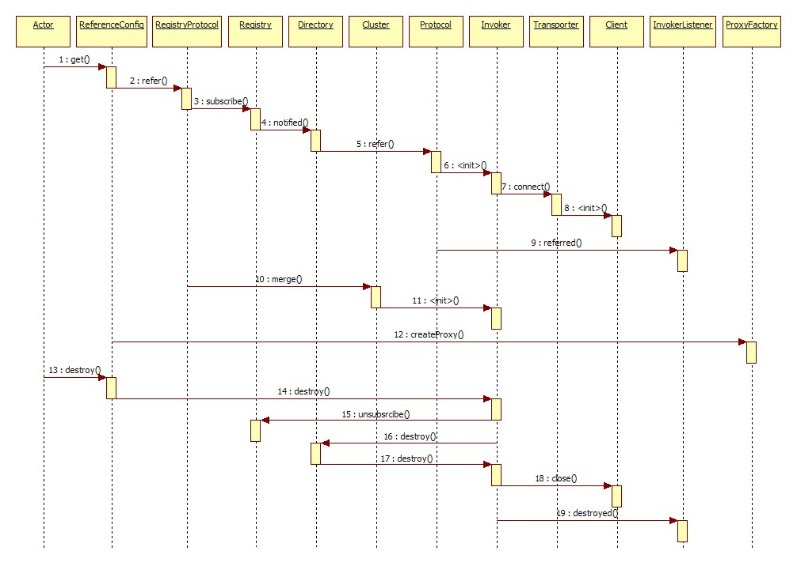
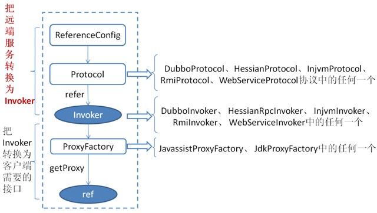
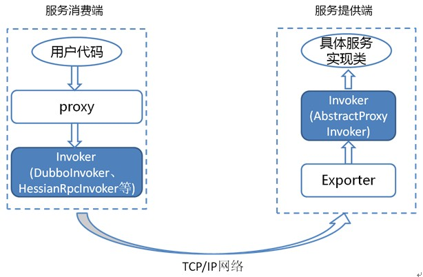

# 06 DUBBO之消费端启动流程

## 服务消费时序

首先来看官网服务消费者方消费服务的绿色初始化链，时序图如下：



官网提供的时序比较粗，只有个大概方向。我自己根据官网的时序图作了一更详细的。但总体流程是一样的。


先从官网提供的图来对整个服务导出(消费)的过程进行总结:

1. Spring事件通知机制：在所有的BeanDefinition创建完成之后，会发起相关的通知。onApplicationEvent。此处为Actor入口
2. 开始本地服务导出：`ServiceConfig`调用`ProxyFacotry#getInvoker(T proxy, Class<T> type, URL url)`，此时url为`injvm`类型。通过字节码技术(默认`JavaAssit`)创建出了`Invoker`代理类，此类代理具体实的实现类。
3. 创建出Invoker之后，然后根据具体的`Protocol`进行导出操作`Protocol#export(Invoker<T> invoker) `。会在导出方法中完成服务器启动，监听相关IP和PORT（通过`Exchanges`和`TransferPort`相关完成），并最终返回Exporter对象。此时，本地服务已经启动完成，可以进行直连调用。
4. 在本地服务导出(服务启动)之后，若服务不需要注册，则结束。如果服务需要注册，则调用`ProxyFacotry#getInvoker(T proxy, Class<T> type, URL url)`，此时url为`Registry`类型。在`RegitstryProtocol`中，会根据具体的协议(比如`DubboProtocol`)先启动服务，然后在调用具体的`registry()`方法进行注册中心注册。

## 消费服务过程

先参考一下官网的消费服务过程图：



上图是服务消费的主过程：

**1、根据配置，生成Invoker**

首先 `ReferenceConfig` 类的 `init` 方法调用 `Protocol` 的 `refer` 方法生成 `Invoker` 实例(如上图中的红色部分)，这是服务消费的关键。

**2.根据Invoker生成具体的代理类Proxy**

即把 `Invoker` 转换为客户端需要的接口(如：HelloWorld)。

关于每种协议如 RMI/Dubbo/Web service 等它们在调用 `refer` 方法生成 `Invoker` 实例的细节和上一章节所描述的类似。

## 详解Invoker

由于 `Invoker` 是 Dubbo 领域模型中非常重要的一个概念，很多设计思路都是向它靠拢。这就使得 `Invoker` 渗透在整个实现代码里，对于刚开始接触 Dubbo 的人，确实容易给搞混了。 下面我们用一个精简的图来说明最重要的两种 `Invoker`：服务提供 `Invoker` 和服务消费 `Invoker`：



为了更好的解释上面这张图，我们结合服务消费和提供者的代码示例来进行说明：

服务消费者代码：

```java
public class DemoClientAction {
 	//因为是消费没有直接实现接口DemoService的类，但通过ProxyFacotry动态生成了其实现类，在Dubbo中称这个实现类为Proxy。
    private DemoService demoService;
 
    public void setDemoService(DemoService demoService) {
        this.demoService = demoService;
    }
 
    public void start() {
        //调用Proxy的方法，然后由Proxy调用消费端根据URI生成的Invoker。
        String hello = demoService.sayHello("world" + i);
    }
}
```

上面代码中的 `DemoService` 就是上图中服务消费端的 proxy，用户代码通过这个 proxy 调用其对应的 `Invoker`。而该 `Invoker` 实现了真正的远程服务调用。

服务提供者代码：

```java
public class DemoServiceImpl implements DemoService {
    public String sayHello(String name) throws RemoteException {
        return "Hello " + name;
    }
}
```

上面这个类会被封装成为一个 `AbstractProxyInvoker` 实例，并新生成一个 `Exporter` 实例。这样当网络通讯层收到一个请求后，会找到对应的 `Exporter` 实例，并调用它所对应的 `AbstractProxyInvoker` 实例，从而真正调用了服务提供者的代码。Dubbo 里还有一些其他的 `Invoker` 类，但上面两种是最重要的。

# 参考资料

https://www.jianshu.com/p/7f3871492c71

https://mp.weixin.qq.com/s/J1yUqFPN6Cf9M01W0paYcA

http://dubbo.apache.org/zh-cn/docs/source_code_guide/export-service.html

 http://dubbo.apache.org/zh-cn/docs/dev/implementation.html 